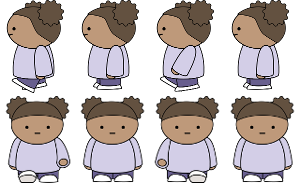
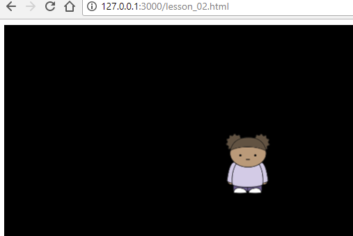
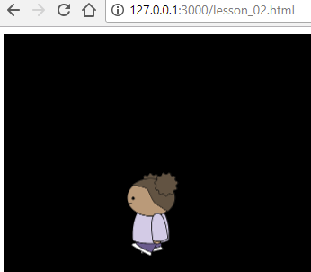

# Lesson 2
Spritesheet

Stationary

Walking

[Demo](https://github.com/codetricity/animation-tutorial.git)

## Concepts for Review

|  Concept              | Category          |    Example       |
|    --------------    | -----------       |    -------------- |
| Create object from constructor | JavaScript | `var game = new Phaser.Game(600, 480);`
| Define object | JavaScript |  `var GameState = { }` |
| Create method | JavaScript | `init: function(){ }` |
| Add game state | Phaser    | `game.state.add('GameState', GameState);` |    

## Steps

1. __Phaser Project Folders:__ `NewProject` inside of project folder `/js/phaser.js`, `index.html`, `/js/main.js`
1. __Script Source Inside of index.html__
1. __Blank screen:__
    (`var game = new Phaser.Game(600, 480);`)
1. __`GameState` object to hold template methods__ - init, preload, create, update
1. __add GameState to game__ (`game.state.add`)
1. __start GameState__ (`game.state.start`)
1. __load spritesheet in preload__ (`this.load.spritesheet('sheetname', 'location', width, height, # of frames)`)
1. __add girl as sprite in create__ (`this.girl = this.add.sprite(x, y, 'sheetname')`)
1. __show single frame of girl in update__
1. __add animation cells in create__ (`this.girl.animations.add('walk', [frame1, frame2], frames per second, true)`)
1. __make girl walk in update__ (`this.girl.animations.play('walk')`)

## Extra

- [flappy bird](https://codetricity.github.io/animation-tutorial/lessons/02/bird.html)
- [flying bird](https://codetricity.github.io/animation-tutorial/lessons/03/)

